# 12月各期节目生成完整调用链

## Mermaid 流程图

```mermaid
flowchart TD
    Start([批量生成入口]) --> BatchGen[batch_generate_december<br/>scripts/batch_generate_december_direct.py]
    
    BatchGen --> SingleEp[generate_single_episode<br/>scripts/batch_generate_december_direct.py]
    
    %% Init 阶段
    SingleEp --> PlanEp[plan_episode<br/>kat_rec_web/backend/t2r/routes/plan.py]
    PlanEp --> Playlist[生成 playlist.csv]
    PlanEp --> Recipe[生成 recipe.json]
    
    %% Cover 阶段
    SingleEp --> GenCover[generate_cover<br/>kat_rec_web/backend/t2r/routes/automation.py]
    GenCover --> TryTitle[_try_api_title<br/>scripts/local_picker/create_mixtape.py]
    GenCover --> ComposeCover[compose_cover<br/>scripts/local_picker/create_mixtape.py]
    ComposeCover --> CoverFile[生成 cover.png]
    
    %% Text 阶段 - Title
    SingleEp --> RegAsset[regenerate_asset<br/>kat_rec_web/backend/t2r/routes/automation.py]
    RegAsset -->|asset_type=title| FillerTitle[_filler_generate_youtube_title_desc<br/>kat_rec_web/backend/t2r/routes/automation.py]
    FillerTitle --> GenTitleDesc[generate_youtube_title_desc<br/>src/core/youtube_assets.py]
    GenTitleDesc --> BuildTitlePrompt[build_title_prompt<br/>src/core/youtube_assets.py]
    GenTitleDesc --> TitleFile[生成 youtube_title.txt]
    
    %% Text 阶段 - Description
    RegAsset -->|asset_type=description| FillerTitle
    GenTitleDesc --> BuildDescPrompt[build_description_prompt<br/>src/core/youtube_assets.py]
    GenTitleDesc --> CleanDesc[clean_youtube_description<br/>src/core/youtube_assets.py]
    CleanDesc --> DescFile[生成 youtube_description.txt]
    
    %% Text 阶段 - Tags
    RegAsset -->|asset_type=tags| FillerTags[_filler_generate_tags_file<br/>kat_rec_web/backend/t2r/routes/automation.py]
    FillerTags --> TagsFile[生成 youtube_tags.txt]
    
    %% Text 阶段 - Captions/SRT
    RegAsset -->|asset_type=captions| FillerSRT[_filler_generate_srt<br/>kat_rec_web/backend/t2r/routes/automation.py]
    FillerSRT --> WelcomingMsg[generate_welcoming_messages<br/>src/core/youtube_assets.py]
    FillerSRT --> FormatSRT[_filler_format_srt_time<br/>kat_rec_web/backend/t2r/routes/automation.py]
    FillerSRT --> SRTFile[生成 youtube.srt]
    
    %% Remix 阶段
    SingleEp --> RunEp[run_episode<br/>kat_rec_web/backend/t2r/routes/plan.py]
    RunEp --> ExecStages[execute_runbook_stages<br/>kat_rec_web/backend/t2r/routes/plan.py]
    ExecStages -->|stage=remix| ExecStage[_execute_stage<br/>kat_rec_web/backend/t2r/routes/plan.py]
    ExecStage --> RemixScript[remix_mixtape.py<br/>scripts/local_picker/remix_mixtape.py]
    RemixScript --> FinalMix[生成 final_mix.mp3]
    RemixScript --> FullMix[生成 full_mix.mp3]
    RemixScript --> TimelineCSV[生成 full_mix_timeline.csv]
    
    %% Render 阶段
    ExecStages -->|stage=render| ExecStage
    ExecStage --> RenderVideo[render_video_direct_from_playlist<br/>kat_rec_web/backend/t2r/utils/direct_video_render.py]
    RenderVideo --> FFmpeg[FFmpeg 视频渲染]
    FFmpeg --> VideoFile[生成 youtube.mp4]
    FFmpeg --> RenderFlag[生成 render_complete.flag]
    
    %% 样式
    classDef entryPoint fill:#e1f5ff,stroke:#01579b,stroke-width:3px
    classDef initStage fill:#f3e5f5,stroke:#4a148c,stroke-width:2px
    classDef coverStage fill:#fff3e0,stroke:#e65100,stroke-width:2px
    classDef textStage fill:#e8f5e9,stroke:#1b5e20,stroke-width:2px
    classDef remixStage fill:#fce4ec,stroke:#880e4f,stroke-width:2px
    classDef renderStage fill:#e0f2f1,stroke:#004d40,stroke-width:2px
    classDef fileOutput fill:#fff9c4,stroke:#f57f17,stroke-width:2px
    
    class Start,BatchGen,SingleEp entryPoint
    class PlanEp,Playlist,Recipe initStage
    class GenCover,TryTitle,ComposeCover coverStage
    class RegAsset,FillerTitle,GenTitleDesc,BuildTitlePrompt,BuildDescPrompt,CleanDesc,FillerTags,FillerSRT,WelcomingMsg,FormatSRT textStage
    class RunEp,ExecStages,ExecStage,RemixScript remixStage
    class RenderVideo,FFmpeg renderStage
    class CoverFile,TitleFile,DescFile,TagsFile,SRTFile,FinalMix,FullMix,TimelineCSV,VideoFile,RenderFlag fileOutput
```

## 调用链详细说明

### 1. 入口函数
- **batch_generate_december** (`scripts/batch_generate_december_direct.py`)
  - 批量生成12月所有31期的入口函数

### 2. 单期生成
- **generate_single_episode** (`scripts/batch_generate_december_direct.py`)
  - 生成单期完整内容的协调函数
  - 按顺序调用：Init → Cover → Text → Remix → Render

### 3. Init 阶段（规划期数）
- **plan_episode** (`kat_rec_web/backend/t2r/routes/plan.py`)
  - 生成 playlist.csv 和 recipe.json
  - 创建期数规划方案

### 4. Cover 阶段（生成封面）
- **generate_cover** (`kat_rec_web/backend/t2r/routes/automation.py`)
  - 选择图片、提取颜色、生成标题、合成封面
- **_try_api_title** (`scripts/local_picker/create_mixtape.py`)
  - 使用 AI API 生成专辑标题
- **compose_cover** (`scripts/local_picker/create_mixtape.py`)
  - 合成封面图片（4K分辨率）

### 5. Text 阶段（生成文本资产）

#### 5.1 标题生成
- **regenerate_asset** (`kat_rec_web/backend/t2r/routes/automation.py`, asset_type="title")
- **_filler_generate_youtube_title_desc** (`kat_rec_web/backend/t2r/routes/automation.py`)
- **generate_youtube_title_desc** (`src/core/youtube_assets.py`)
- **build_title_prompt** (`src/core/youtube_assets.py`)
  - 构建标题生成的 prompt

#### 5.2 描述生成
- **regenerate_asset** (`kat_rec_web/backend/t2r/routes/automation.py`, asset_type="description")
- **_filler_generate_youtube_title_desc** (同上)
- **generate_youtube_title_desc** (同上)
- **build_description_prompt** (`src/core/youtube_assets.py`)
  - 构建描述生成的 prompt
- **clean_youtube_description** (`src/core/youtube_assets.py`)
  - 清理描述格式（移除 markdown、分隔符等）

#### 5.3 标签生成
- **regenerate_asset** (`kat_rec_web/backend/t2r/routes/automation.py`, asset_type="tags")
- **_filler_generate_tags_file** (`kat_rec_web/backend/t2r/routes/automation.py`)
  - 生成标签文件

#### 5.4 字幕生成
- **regenerate_asset** (`kat_rec_web/backend/t2r/routes/automation.py`, asset_type="captions")
- **_filler_generate_srt** (`kat_rec_web/backend/t2r/routes/automation.py`)
  - 生成 SRT 字幕文件
- **generate_welcoming_messages** (`src/core/youtube_assets.py`)
  - 生成欢迎和结束消息
- **_filler_format_srt_time** (`kat_rec_web/backend/t2r/routes/automation.py`)
  - 格式化 SRT 时间戳

### 6. Remix 阶段（音频混音）
- **run_episode** (`kat_rec_web/backend/t2r/routes/plan.py`, stages=["remix"])
- **execute_runbook_stages** (`kat_rec_web/backend/t2r/routes/plan.py`)
- **_execute_stage** (`kat_rec_web/backend/t2r/routes/plan.py`, stage="remix")
- **remix_mixtape.py** (`scripts/local_picker/remix_mixtape.py`)
  - 执行音频混音，生成 final_mix.mp3、full_mix.mp3 和 timeline CSV

### 7. Render 阶段（视频渲染）
- **run_episode** (`kat_rec_web/backend/t2r/routes/plan.py`, stages=["render"])
- **execute_runbook_stages** (`kat_rec_web/backend/t2r/routes/plan.py`)
- **_execute_stage** (`kat_rec_web/backend/t2r/routes/plan.py`, stage="render")
- **render_video_direct_from_playlist** (`kat_rec_web/backend/t2r/utils/direct_video_render.py`)
  - 直接从 playlist 渲染视频（使用 final_mix.mp3）
  - 调用 FFmpeg 生成 4K 视频
  - 创建 render_complete.flag 标记文件

## 生成的文件

### Init 阶段
- `playlist.csv` - 歌单文件
- `recipe.json` - 生成方案

### Cover 阶段
- `{episode_id}_cover.png` - 封面图片（4K）

### Text 阶段
- `{episode_id}_youtube_title.txt` - YouTube 标题
- `{episode_id}_youtube_description.txt` - YouTube 描述
- `{episode_id}_youtube_tags.txt` - YouTube 标签
- `{episode_id}_youtube.srt` - YouTube 字幕

### Remix 阶段
- `{episode_id}_final_mix.mp3` - 最终混音（256kbps）
- `{episode_id}_full_mix.mp3` - 完整混音（320kbps）
- `{episode_id}_full_mix_timeline.csv` - 时间轴文件

### Render 阶段
- `{episode_id}_youtube.mp4` - 最终视频（4K）
- `{episode_id}_render_complete.flag` - 渲染完成标记

