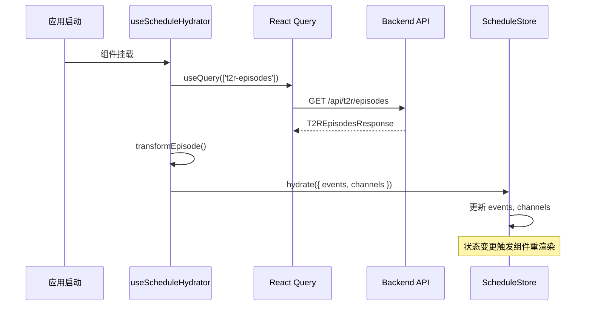
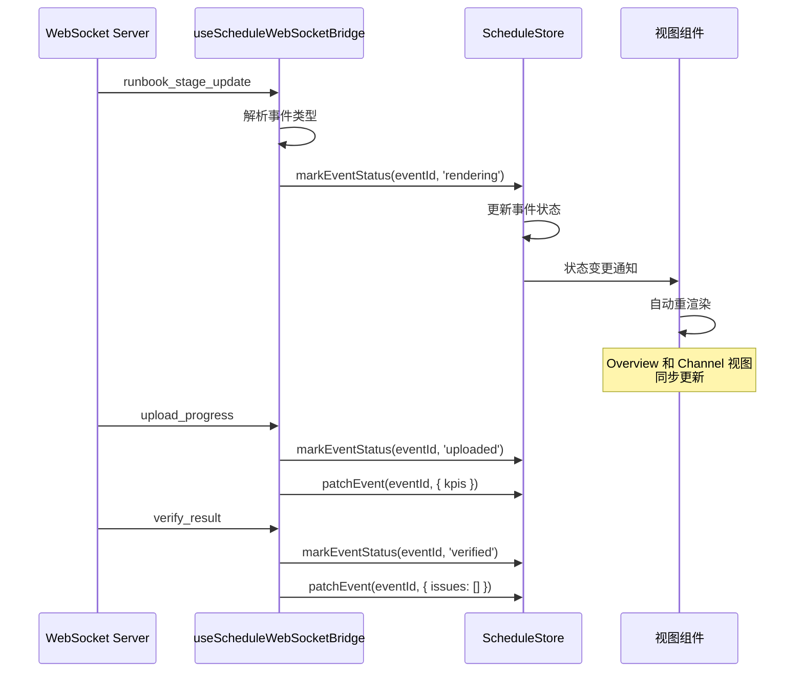
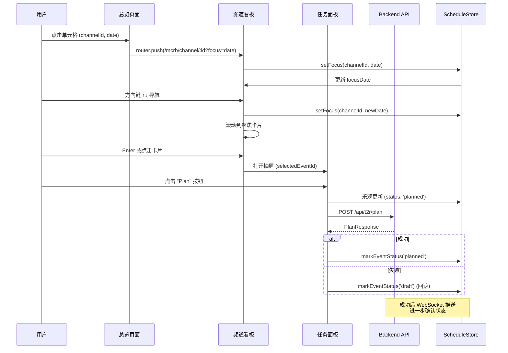
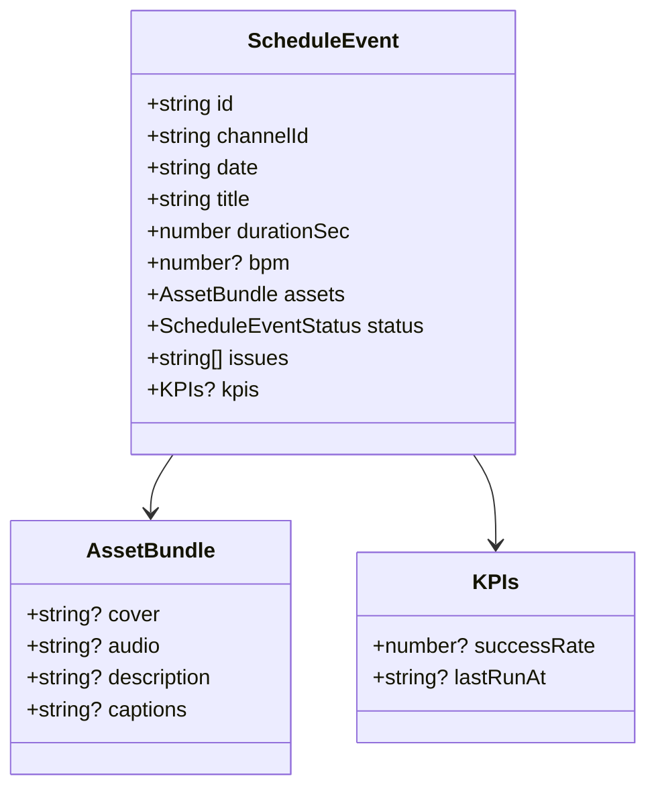
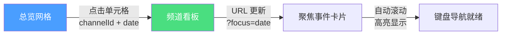
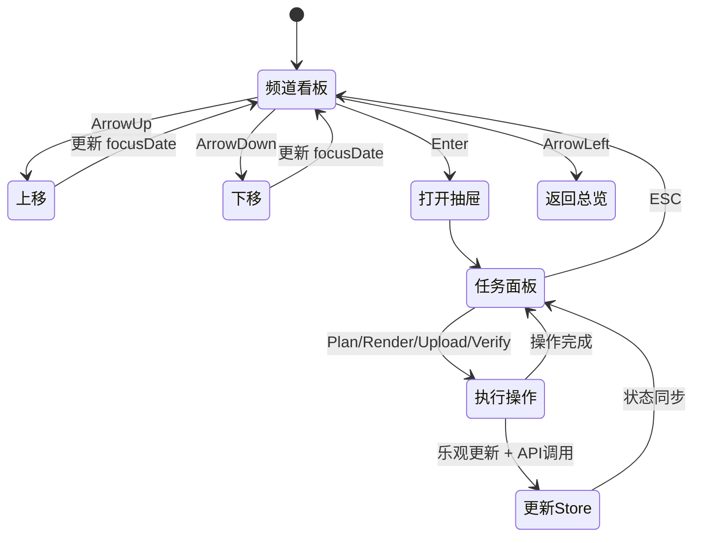
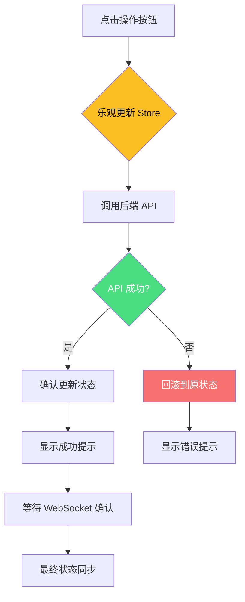
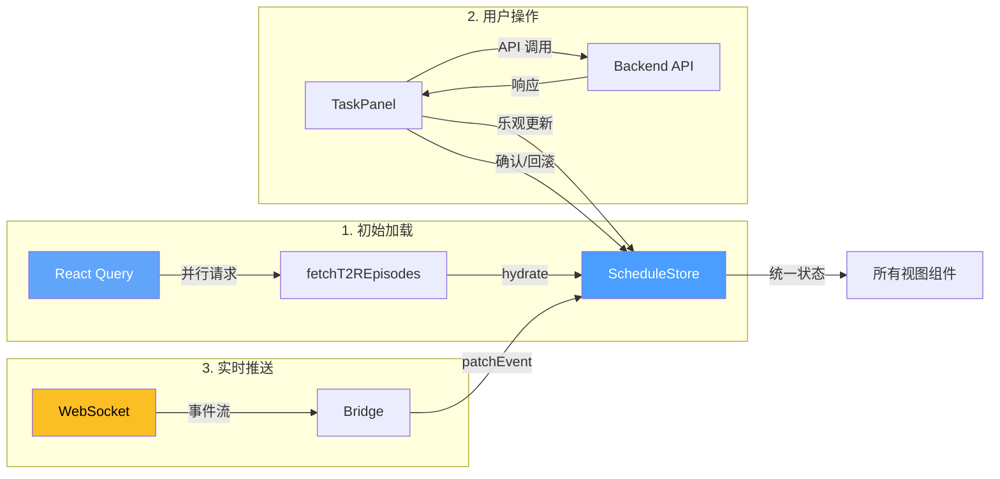
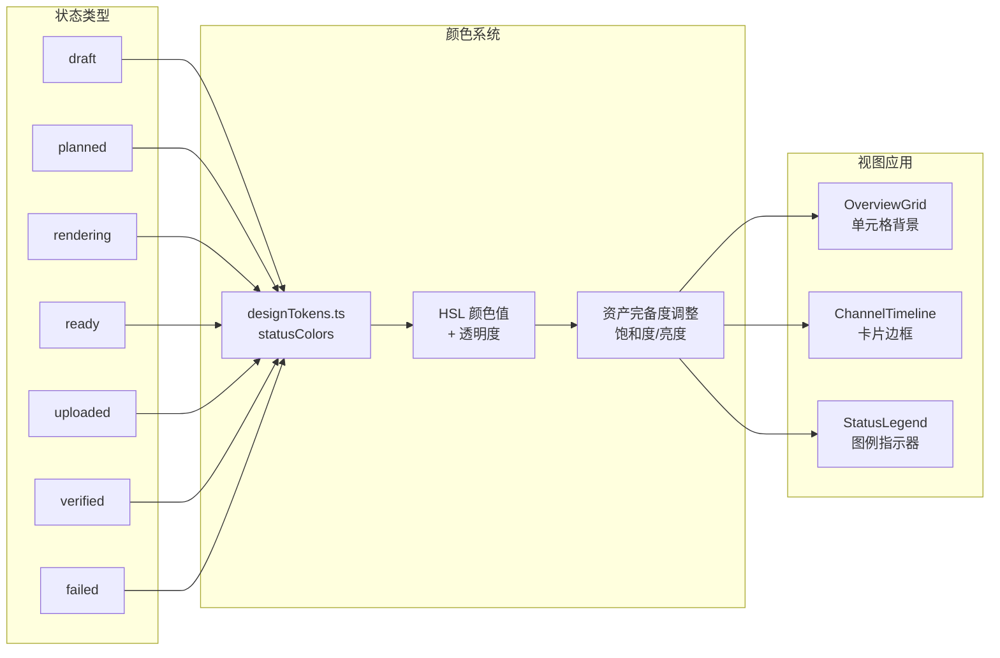
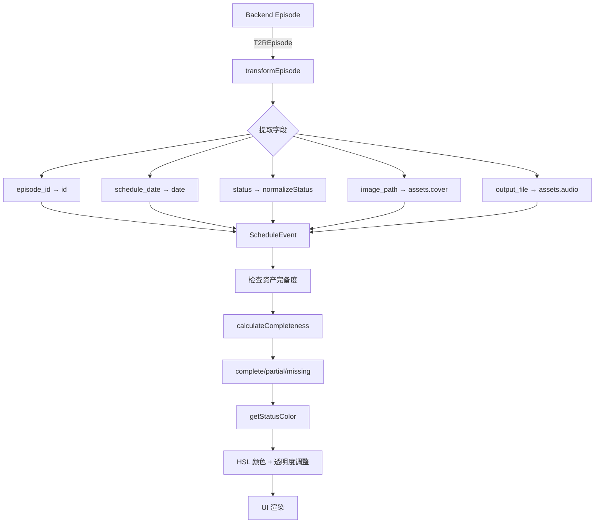

# Kat Rec Workbench 交互与数据流总览

## 📐 系统架构总览

```mermaid
graph TB
    subgraph "数据层"
        API[Backend APIs<br/>/api/t2r/*<br/>/api/mcrb/*]
        WS[WebSocket<br/>/ws/status]
    end
    
    subgraph "状态管理层 (Zustand)"
        Store[ScheduleStore<br/>SSOT 单一真实数据源]
        Store --> |channels<br/>events<br/>focusDate<br/>dateRange| Data[统一状态模型]
    end
    
    subgraph "数据加载层"
        Hydrator[useScheduleHydrator<br/>React Query]
        Bridge[useScheduleWebSocketBridge<br/>WebSocket Bridge]
    end
    
    subgraph "视图层"
        Overview[全局总览<br/>/mcrb/overview]
        Channel[频道看板<br/>/mcrb/channel/:id]
        TaskPanel[任务面板<br/>TaskPanel]
    end
    
    API -->|fetchT2REpisodes<br/>fetchT2RChannel| Hydrator
    Hydrator -->|hydrate()| Store
    WS -->|实时事件| Bridge
    Bridge -->|patchEvent()<br/>markEventStatus()| Store
    
    Store -->|visibleEvents()<br/>statusCounts()| Overview
    Store -->|visibleEvents(channelId)| Channel
    Store -->|selectedEvent| TaskPanel
    
    Overview -->|点击单元格| Channel
    Channel -->|Enter/点击| TaskPanel
    TaskPanel -->|Plan/Render/Upload/Verify| API
    
    style Store fill:#4a9eff,color:#fff
    style API fill:#4ade80,color:#fff
    style WS fill:#fbbf24,color:#000
```

## 🔄 数据流详解

### 1. 初始化数据流



### 2. WebSocket 实时更新流



### 3. 用户操作流



## 🏗️ 组件层次结构

```mermaid
graph TD
    subgraph "路由层"
        Layout[app/(mcrb)/layout.tsx]
        OverviewPage[app/(mcrb)/mcrb/overview/page.tsx]
        ChannelPage[app/(mcrb)/mcrb/channel/[id]/page.tsx]
    end
    
    subgraph "布局组件"
        GlobalNav[GlobalNav<br/>频道选择器<br/>窗口切换器]
    end
    
    subgraph "总览视图"
        OverviewGrid[OverviewGrid<br/>热力图网格]
        StatusLegend[StatusLegend<br/>状态分布]
        CellTooltip[CellTooltip<br/>悬停提示]
    end
    
    subgraph "频道视图"
        ChannelTimeline[ChannelTimeline<br/>时间线卡片列表]
        TaskPanel[TaskPanel<br/>任务操作抽屉]
    end
    
    Layout --> GlobalNav
    Layout --> OverviewPage
    Layout --> ChannelPage
    
    OverviewPage --> OverviewGrid
    OverviewPage --> StatusLegend
    OverviewGrid --> CellTooltip
    
    ChannelPage --> ChannelTimeline
    ChannelPage --> TaskPanel
    
    style Layout fill:#2a2a2a,color:#fff
    style OverviewPage fill:#4a9eff,color:#fff
    style ChannelPage fill:#4ade80,color:#fff
```

## 📊 状态管理模型

### ScheduleStore 结构

```typescript
interface ScheduleStore {
  // 核心数据
  channels: string[]                    // 频道 ID 列表
  events: Record<string, ScheduleEvent[]>  // 按频道分组的事件
  selectedChannel: string | null
  focusDate: string | null              // 聚焦的日期
  dateRange: DateRange                  // 时间窗口
  
  // 派生数据（计算属性）
  visibleEvents(channelId?): ScheduleEvent[]
  channelSummaries(): ChannelSummary[]
  statusCounts(channelId?): Record<Status, number>
  
  // 操作方法
  hydrate(data): void                   // 初始化数据
  setDateRange(range): void             // 设置时间窗口
  setFocus(channelId, date): void      // 设置聚焦
  upsertEvents(channelId, events): void // 更新/插入事件
  patchEvent(eventId, updates): void   // 部分更新事件
  markEventStatus(eventId, status): void // 标记状态
}
```

### 事件数据模型



## 🎯 交互路径

### 路径 1: 总览 → 频道看板



### 路径 2: 键盘导航



### 路径 3: 任务操作流程



## 🔌 数据同步机制

### 三种数据源



## 🎨 视觉状态映射

### 状态 → 颜色 → 视图



## 🔐 关键设计原则

### 1. SSOT (Single Source of Truth)
- **ScheduleStore** 是唯一的状态源
- 所有视图从 Store 读取，不保留本地状态
- API 响应和 WebSocket 事件都写入 Store

### 2. 乐观更新
- 用户操作立即更新 UI
- API 调用在后台进行
- 失败时回滚，成功时确认

### 3. 实时同步
- WebSocket 推送状态变更
- 总览和频道视图自动同步
- 无需手动刷新

### 4. 深链接支持
- URL 包含 channelId 和 focus 参数
- 支持书签和直接访问
- 导航状态持久化

## 📝 数据转换流程



## 🚀 性能优化

### 虚拟化渲染
- OverviewGrid 支持大量日期列
- 使用表格固定列头和频道名
- 未来可集成 `react-virtuoso` 优化大数据量

### 选择器优化
- Zustand 选择器避免不必要的重渲染
- 组件只订阅需要的状态切片

### 请求缓存
- React Query 缓存 API 响应
- 30 秒 staleTime，60 秒自动刷新

---

**文档版本**: v1.0  
**最后更新**: 2025-11-03  
**维护者**: Kat Rec 开发团队
