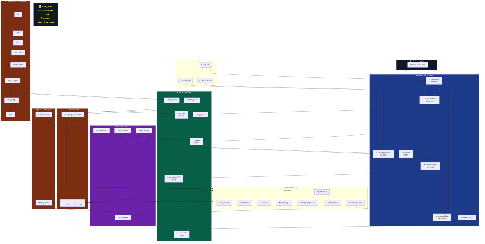

```mermaid
flowchart TB
    %% ============ GLOBAL STYLE ============
    classDef layerFront fill:#1e3a8a,stroke:#1e3a8a,color:#fff
    classDef layerBackend fill:#065f46,stroke:#065f46,color:#fff
    classDef layerFS fill:#4b5563,stroke:#4b5563,color:#fff
    classDef layerPipeline fill:#7c2d12,stroke:#7c2d12,color:#fff
    classDef layerWS fill:#6b21a8,stroke:#6b21a8,color:#fff
    classDef layerSched fill:#0f172a,stroke:#0f172a,color:#fff

    classDef titleStyle fill:#111827,color:#facc15,font-size:28px,font-weight:bold

    %% TITLE
    A0["🎛️ Kat_Rec Stateflow V4 — Full-System Architecture"]:::titleStyle

    %% ============ USER ============
    subgraph USER [🧑 User Layer]
        U1("🖱️ Click Cell")
        U2("📋 Open TaskPanel")
        U3("👀 View Progress")
    end
    class USER layerFront

    %% ============ FRONTEND ============
    subgraph FE [🎨 Frontend • Next.js + React]
        OG["📅 OverviewGrid<br><sub>主控制面板</sub>"]
        TP["🧰 TaskPanel<br><sub>任务操作</sub>"]
        GPS["📊 GridProgressSimple<br><sub>统一进度条</sub>"]

        subgraph Hooks [🪝 Hooks]
            UA["🧩 useEpisodeAssets<br><sub>全局资产检测</sub>"]
            VP["🎬 useVideoProgress<br><sub>统一渲染进度</sub>"]
            US["☁️ useUploadState<br><sub>上传+验证状态</sub>"]
        end

        ZS["📦 Zustand Stores"]
    end
    class FE layerFront
    class Hooks layerFront

    USER --> U1 --> OG
    USER --> U2 --> TP
    USER --> U3 --> GPS

    OG --> UA
    OG --> VP
    OG --> US

    TP --> UA
    TP --> VP
    TP --> US

    GPS --> UA
    GPS --> VP
    GPS --> US

    %% ============ BACKEND API ============
    subgraph BE [🛠️ Backend • FastAPI]
        EP_API["/assets API<br><sub>文件检测</sub>"]
        VP_API["/video-progress API<br><sub>渲染进度</sub>"]
        META_API["/metadata API<br><sub>元数据</sub>"]
        WS_API["🔌 WS Hub<br><sub>事件分发</sub>"]

        RQ_API["/render_queue"]
        UQ_API["/upload_queue"]
        VW_API["/verify_worker"]
    end
    class BE layerBackend

    UA --> EP_API
    VP --> VP_API
    US --> META_API

    %% ============ FILESYSTEM ============
    subgraph FS [📁 Filesystem SSOT<br><sub>唯一真相来源</sub>]
        DIR["episode folder"]
        MIX["🎵 full_mix.mp3"]
        TIMELINE["⏱ timeline.csv"]
        COVER["🖼 cover.png"]
        VIDEO["🎬 youtube.mp4"]
        FLAG["🏁 render_complete.flag"]
        ULOG["☁️ upload_log.json"]
        DESC["📝 description.txt"]
    end
    class FS layerFS

    EP_API --> FS
    VP_API --> FS
    META_API --> FS

    %% ============ RENDER PIPELINE ============
    subgraph RENDER [🔥 Render Pipeline]
        RQ_SVC["🧵 RenderQueue Service"]
        RPS["📡 render_progress_service.py"]
    end
    class RENDER layerPipeline

    RQ_API --> RQ_SVC --> FS
    FS --> RPS --> VP_API

    %% ============ UPLOAD + VERIFY ============
    subgraph UPLOAD [🚚 Upload + Verify Pipeline]
        UQ_SVC["⬆️ UploadQueue"]
        VW_SVC["🔍 VerifyWorker"]
    end
    class UPLOAD layerPipeline

    UQ_API --> UQ_SVC --> FS
    FS --> VW_SVC --> FS
    FS --> ULOG --> US

    %% ============ SCHEDULE ============
    subgraph SCHED [🗂 Schedule Mapping]
        SCH["schedule_master.json"]
    end
    class SCHED layerSched

    SCH --> OG
    SCH --> TP

    %% ============ EPISODE FLOW ============
    subgraph FLOW [⚙️ EpisodeFlow • V4 Simplified]
        INIT["Init"]
        REMIX["Remix"]
        COVER_STG["Cover"]
        TEXT_STG["Text Assets"]
        RENDER_STG["Render Trigger"]
        UPLOAD_STG["Upload Trigger"]
        VERIFY_STG["Verify Trigger"]
        DONE["Done"]
    end
    class FLOW layerPipeline

    INIT --> REMIX --> COVER_STG --> TEXT_STG --> RENDER_STG --> UPLOAD_STG --> VERIFY_STG --> DONE

    RENDER_STG --> RQ_API
    UPLOAD_STG --> UQ_API
    VERIFY_STG --> VW_API

    %% ============ WEBSOCKET ============
    subgraph WS [📡 WebSocket • Unified V4]
        ASSET_EV["assets_updated"]
        RENDER_EV["render_updated"]
        UPLOAD_EV["upload_updated"]
        VERIFY_EV["verify_updated"]
    end
    class WS layerWS

    RQ_SVC --> RENDER_EV --> WS_API
    UQ_SVC --> UPLOAD_EV --> WS_API
    VW_SVC --> VERIFY_EV --> WS_API
    EP_API --> ASSET_EV --> WS_API

    WS_API --> OG
    WS_API --> TP
    WS_API --> GPS
```
