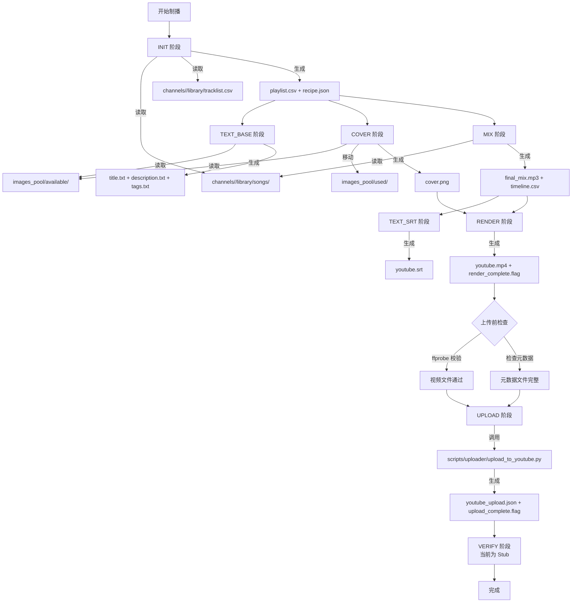

# 制播流程输入文件夹与上传验证检查

本文档详细说明 McPOS 制播流程的主要输入文件夹结构，以及 YouTube 上传内容的完整验证机制。

## 一、主要输入文件夹结构

### 1. 曲库（音频文件）
- **路径**：`channels/<channel_id>/library/songs/`
- **用途**：存放所有可用的音频文件（MP3、WAV、FLAC、M4A、AAC）
- **读取方式**：通过 `mcpos/adapters/filesystem.py::get_channel_library_songs()` 扫描
- **示例**：
  - `channels/kat/library/songs/` - Kat 频道曲库
  - `channels/rbr/library/songs/` - RBR 频道曲库
  - `channels/kat_lofi/library/songs/` - Kat Lo-Fi 频道曲库

### 2. 曲目元数据
- **路径**：`channels/<channel_id>/library/tracklist.csv`
- **用途**：存储曲目时长信息（用于混音阶段计算总时长）
- **读取方式**：通过 `mcpos/adapters/filesystem.py::get_track_durations_from_library()` 解析
- **格式**：CSV，包含 `title`/`Title` 和 `duration`/`Duration` 列
- **示例列**：
  ```csv
  title,Duration
  song1.mp3,3:45
  song2.mp3,240
  ```

### 3. 图库（封面图片）
- **可用图片**：`images_pool/available/` - 未使用的图片
- **已用图片**：`images_pool/used/` - 已分配给节目的图片
- **用途**：封面生成阶段从 `available/` 选择图片，生成后移动到 `used/`
- **管理函数**：
  - `list_available_images()` - 列出可用图片
  - `move_image_to_used()` - 标记图片已使用
  - `move_image_to_available()` - 重置时恢复图片
- **文件格式**：PNG 格式，建议 4K 分辨率（3840×2160）

### 4. 设计资源
- **路径**：`assets/` - 字体、蒙版等设计资源
- **字体**：`assets/fonts/`（可选，如果未设置则使用系统字体）
- **设计资源**：`assets/design/` - 蒙版等
- **配置**：通过 `McPOSConfig.cover_font_path` 指定字体路径

### 5. 配置文件
- **McPOS 配置**：`config/config.yaml` - YouTube 上传配置、API keys 等
- **OAuth 凭证**：
  - `config/google/client_secrets.json` - Google OAuth 客户端密钥
  - `config/google/youtube_token.json` - YouTube API token
- **API Keys**：
  - `config/openai_api_key.txt` - OpenAI API Key（用于 AI 生成）
  - 或环境变量 `OPENAI_API_KEY`

## 二、输出文件夹结构

### 每期节目输出目录
- **路径**：`channels/<channel_id>/output/<episode_id>/`
- **文件清单**（按阶段）：

#### INIT 阶段
- `playlist.csv` - 曲目选择列表（包含 track path, duration, side, order）
- `recipe.json` - 期数元数据（episode_id, channel_id, target_duration, track_ids, cover_image_filename）

#### TEXT_BASE 阶段
- `<episode_id>_youtube_title.txt` - YouTube 标题（单行，UTF-8）
- `<episode_id>_youtube_description.txt` - YouTube 描述（多行，UTF-8）
- `<episode_id>_youtube_tags.txt` - YouTube 标签（每行一个，UTF-8）

#### COVER 阶段
- `<episode_id>_cover.png` - 封面图片（4K: 3840×2160，RGB 格式）

#### MIX 阶段
- `<episode_id>_final_mix.mp3` - 混音音频（256 kbps CBR, 48 kHz, 16-bit）
- `<episode_id>_final_mix_timeline.csv` - 时间轴文件（start_time, end_time, track_path）

#### TEXT_SRT 阶段
- `<episode_id>_youtube.srt` - 字幕文件（SRT 格式，标准时间码 HH:MM:SS,mmm）

#### RENDER 阶段
- `<episode_id>_youtube.mp4` - 最终视频（4K 分辨率，H.264，CRF 35）
- `<episode_id>_render_complete.flag` - 渲染完成标记（空文件或最小 JSON）

#### UPLOAD 阶段（上传后生成）
- `<episode_id>_youtube_upload.json` - 上传结果 JSON（包含 video_id、video_url 等）
- `<episode_id>_upload_complete.flag` - 上传完成标记（空文件）

## 三、YouTube 上传验证机制

### 上传前检查（`mcpos/adapters/uploader.py`）

#### 1. 视频文件检查（`_ensure_video_asset_ok()`）
- **文件存在性**：检查 `youtube_mp4` 是否存在
- **文件大小**：检查文件大小 > 0
- **ffprobe 校验**（`_probe_video_asset()`）：
  - 视频流存在（codec_type == "video"）
  - 音频流存在（codec_type == "audio"）
  - 时长 > 0.01 秒（允许极短测试资源，但拒绝空文件）
  - 文件大小 > 0（以 ffprobe format.size 为准）

#### 2. 必需元数据文件检查（`_build_upload_params()`）
- **标题文件**：`youtube_title_txt` 必须存在且非空
- **描述文件**：`youtube_description_txt` 必须存在（内容可以为空，YouTube 允许）
- **标签文件**：`youtube_tags_txt` 必须存在且至少包含一个标签
- **字幕文件**：`youtube_srt` 必须存在（用于上传字幕）

#### 3. 可选文件
- **缩略图**：`cover_png` 可选（缺失时跳过缩略图上传，旧世界脚本会自动调整大小：最大 1280x720 像素，最大 2MB）

### 上传后验证

#### 1. 上传结果文件
- **路径**：`channels/<channel_id>/output/<episode_id>/<episode_id>_youtube_upload.json`
- **内容**：
  ```json
  {
    "episode_id": "kat_20250108",
    "channel_id": "kat",
    "video_id": "dQw4w9WgXcQ",
    "video_url": "https://www.youtube.com/watch?v=dQw4w9WgXcQ",
    "status": "completed",
    "uploaded_at": "2025-01-08T12:00:00Z",
    "duration_seconds": 1800
  }
  ```

#### 2. 上传完成标记
- **路径**：`channels/<channel_id>/output/<episode_id>/<episode_id>_upload_complete.flag`
- **用途**：空文件或最小 JSON，标记上传完成（用于批处理脚本判断）

#### 3. 验证函数（当前为 Stub）
- **函数**：`verify_episode_upload()`（`mcpos/adapters/uploader.py`）
- **当前状态**：Stub 实现，直接返回 `verified`，不调用 YouTube API
- **未来实现**：通过 YouTube API 查询视频状态确认上传成功

## 四、检查清单

### 上传前手动检查

#### 1. 视频文件检查
```bash
# 检查文件存在性和大小
ls -lh channels/<channel_id>/output/<episode_id>/*.mp4

# 使用 ffprobe 检查视频完整性
ffprobe -v error -hide_banner -show_streams -show_format \
  channels/<channel_id>/output/<episode_id>/<episode_id>_youtube.mp4
```

#### 2. 元数据文件检查
```bash
# 检查标题文件
cat channels/<channel_id>/output/<episode_id>/*_youtube_title.txt

# 检查描述文件
cat channels/<channel_id>/output/<episode_id>/*_youtube_description.txt

# 检查标签文件
cat channels/<channel_id>/output/<episode_id>/*_youtube_tags.txt
```

#### 3. 字幕文件检查
```bash
# 查看字幕文件前 20 行
head -20 channels/<channel_id>/output/<episode_id>/*.srt

# 检查字幕文件格式
file channels/<channel_id>/output/<episode_id>/*.srt
```

#### 4. 封面文件检查（可选）
```bash
# 检查封面文件
ls -lh channels/<channel_id>/output/<episode_id>/*_cover.png

# 使用 ImageMagick 检查图片尺寸（如果已安装）
identify channels/<channel_id>/output/<episode_id>/*_cover.png
```

### 上传后验证

#### 1. 检查上传结果 JSON
```bash
# 查看上传结果
cat channels/<channel_id>/output/<episode_id>/*_youtube_upload.json

# 使用 jq 格式化查看（如果已安装）
cat channels/<channel_id>/output/<episode_id>/*_youtube_upload.json | jq .
```

#### 2. 检查上传标记
```bash
# 检查上传完成标记
ls -la channels/<channel_id>/output/<episode_id>/*_upload_complete.flag
```

#### 3. 验证 video_id
```bash
# 从 JSON 文件中提取 video_id
VIDEO_ID=$(cat channels/<channel_id>/output/<episode_id>/*_youtube_upload.json | jq -r '.video_id')

# 访问 YouTube URL 确认视频存在
echo "https://www.youtube.com/watch?v=${VIDEO_ID}"
```

## 五、关键代码位置

- **输入文件夹配置**：`mcpos/config.py::McPOSConfig`
  - `channels_root` - 频道根目录
  - `images_pool_available` - 可用图片目录
  - `images_pool_used` - 已用图片目录
  
- **文件系统操作**：`mcpos/adapters/filesystem.py`
  - `get_channel_library_songs()` - 获取频道曲库
  - `get_track_durations_from_library()` - 读取曲目时长
  - `list_available_images()` - 列出可用图片
  - `detect_episode_state_from_filesystem()` - 检测期数状态
  
- **上传逻辑**：`mcpos/adapters/uploader.py`
  - `upload_episode_video()` - 上传视频
  - `_ensure_video_asset_ok()` - 视频文件检查
  - `_probe_video_asset()` - ffprobe 校验
  - `_build_upload_params()` - 构建上传参数
  - `verify_episode_upload()` - 验证上传（当前为 Stub）
  
- **资产路径定义**：`mcpos/models.py::AssetPaths`
  - 所有输出文件的路径定义
  
- **状态检测**：`mcpos/adapters/filesystem.py::detect_episode_state_from_filesystem()`
  - 基于文件存在性检测各阶段完成状态

## 六、流程图



## 七、常见问题排查

### 问题 1：找不到曲目文件
- **症状**：MIX 阶段报错 "Track not found"
- **检查**：
  ```bash
  # 确认曲库目录存在
  ls -la channels/<channel_id>/library/songs/
  
  # 检查 playlist.csv 中的曲目路径
  cat channels/<channel_id>/output/<episode_id>/playlist.csv
  ```
- **解决**：
  - 确认 `channels/<channel_id>/library/songs/` 目录存在且包含音频文件
  - 检查 `playlist.csv` 中的曲目路径是否正确
  - 确认音频文件扩展名匹配（.mp3, .wav, .flac, .m4a, .aac）

### 问题 2：上传失败 - 视频文件无效
- **症状**：上传时提示 "ffprobe 校验失败" 或 "no video stream found"
- **检查**：
  ```bash
  # 运行 ffprobe 查看详细信息
  ffprobe -v error -hide_banner -show_streams -show_format \
    channels/<channel_id>/output/<episode_id>/<episode_id>_youtube.mp4
  ```
- **解决**：
  - 确认视频文件包含视频流和音频流
  - 确认时长 > 0.01 秒
  - 确认文件大小 > 0
  - 如果文件损坏，重新运行 RENDER 阶段

### 问题 3：上传失败 - 元数据缺失
- **症状**：上传时提示 "Required asset missing"
- **检查**：
  ```bash
  # 检查所有必需文件
  ls -la channels/<channel_id>/output/<episode_id>/*_youtube_*.txt
  ls -la channels/<channel_id>/output/<episode_id>/*.srt
  ```
- **解决**：
  - 确认 TEXT_BASE 阶段已生成所有必需文件
  - 确认 TEXT_SRT 阶段已生成字幕文件
  - 重新运行缺失的阶段或手动创建缺失文件

### 问题 4：无法验证上传结果
- **症状**：上传后无法确认视频是否成功上传
- **检查**：
  ```bash
  # 查看上传结果 JSON
  cat channels/<channel_id>/output/<episode_id>/*_youtube_upload.json
  
  # 检查是否有有效的 video_id
  jq -r '.video_id' channels/<channel_id>/output/<episode_id>/*_youtube_upload.json
  ```
- **解决**：
  - 从 JSON 文件中提取 `video_id`
  - 手动访问 `https://www.youtube.com/watch?v=<video_id>` 确认视频存在
  - 如果 video_id 无效，检查上传脚本的输出日志

### 问题 5：图片库管理问题
- **症状**：封面生成时找不到可用图片
- **检查**：
  ```bash
  # 检查可用图片数量
  ls images_pool/available/*.png | wc -l
  
  # 检查已用图片
  ls images_pool/used/*.png | wc -l
  ```
- **解决**：
  - 确认 `images_pool/available/` 目录包含 PNG 文件
  - 如果所有图片都在 `used/` 目录，考虑重置期数或添加新图片
  - 使用 `move_image_to_available()` 恢复图片

## 八、自动化检查脚本

可以使用以下 Python 脚本进行自动化检查：

```python
#!/usr/bin/env python3
"""
检查期数上传前的所有必需文件
"""
import sys
from pathlib import Path
from mcpos.adapters.filesystem import build_asset_paths
from mcpos.models import EpisodeSpec
from mcpos.config import get_config

def check_episode_upload_readiness(channel_id: str, episode_id: str) -> bool:
    """检查期数是否准备好上传"""
    spec = EpisodeSpec(channel_id=channel_id, episode_id=episode_id)
    config = get_config()
    paths = build_asset_paths(spec, config)
    
    # 检查必需文件
    required_files = [
        (paths.youtube_mp4, "视频文件"),
        (paths.youtube_title_txt, "标题文件"),
        (paths.youtube_description_txt, "描述文件"),
        (paths.youtube_tags_txt, "标签文件"),
        (paths.youtube_srt, "字幕文件"),
    ]
    
    all_ok = True
    for file_path, name in required_files:
        if not file_path.exists():
            print(f"❌ {name} 缺失: {file_path}")
            all_ok = False
        else:
            print(f"✅ {name} 存在: {file_path}")
    
    return all_ok

if __name__ == "__main__":
    if len(sys.argv) != 3:
        print("用法: python check_upload_readiness.py <channel_id> <episode_id>")
        sys.exit(1)
    
    channel_id = sys.argv[1]
    episode_id = sys.argv[2]
    
    if check_episode_upload_readiness(channel_id, episode_id):
        print("\n✅ 所有必需文件已就绪，可以上传")
        sys.exit(0)
    else:
        print("\n❌ 部分必需文件缺失，请先完成相关阶段")
        sys.exit(1)
```

## 九、参考文档

- [McPOS Asset Contract](./ASSET_CONTRACT.md) - 资产文件契约
- [McPOS Dev Bible](../Dev_Bible.md) - 开发规范
- [Upload Guide](./UPLOAD_GUIDE.md) - 上传详细指南
- [Channel Production Spec](./CHANNEL_PRODUCTION_SPEC.md) - 频道生产规范
